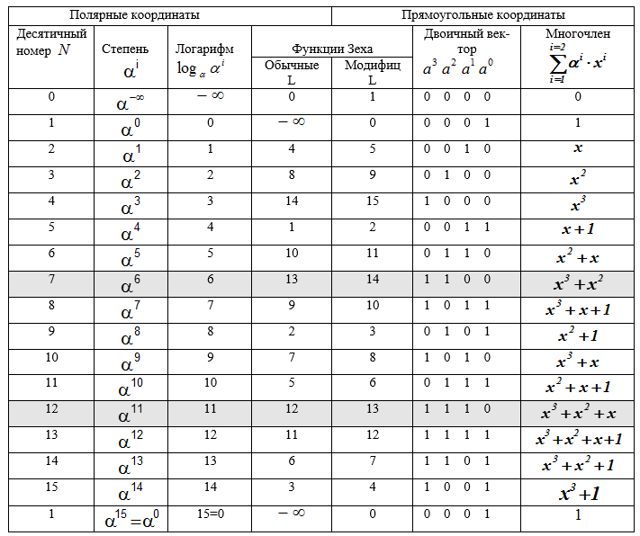

# Encoding and Encryption

## Содержание

- [Эффективное кодирование](#эффективное-кодирование)
- [Архиватор на основе алгоритма Хаффмана](#архиватор-файлов-по-алгоритму-хаффмана)
- [Помехоустойчивое кодирование](#помехоустойчивое-кодирование)

## Эффективное кодирование

Сравнение способов кодирования Шеннона-Фано и Хаффмана!

- **Построение кодов** по вектору вероятностей.
- **Вычисление**: средней длинны кодов, коэффициентов статистического сжатия и относительной эффективности.

### Построение кодов Шеннона-Фано

1. Вектор вероятностей сортируется
2. Каждый раз он делится на две примерно равные по сумме части, кодам первой приписывается `0`, кодам второй - `1`.

### Построение кодов Хаффмана

1. Записываем все вероятности в бинарную кучу `BinaryHeap`.
2. Извлекаем две самые маленькие и объединяем в узел дерева `HuffmanTree::Node` с двумя листьями `HuffmanTree::Leaf`. Кладем узел обратно в кучу, вероятность Node будет равна сумме листьев Leaf.
3. Повторяем пока в куче не останется один корневой элемент. Извлекаем из дерева коды, считая, что переход по левой ветке `0`, по правой - `1`.

### Binary

```sh
cargo run --bin efficient_encoding
```

Пример работы:

```text
Enter a vector of probabilities of characters appearing separated by a whitespace:
0.170 0.168 0.166 0.140 0.118 0.110 0.083 0.045
```

Полученные данные:

| Name         | Probabilities                                         | Codes                                                     | Mean length | Relative efficiency ratio | Statistical compression ratio |
| ------------ | ----------------------------------------------------- | --------------------------------------------------------- | ----------- | ------------------------- | ----------------------------- |
| Shannon-Fano | [0.17, 0.168, 0.166, 0.14, 0.118, 0.11, 0.083, 0.045] | ["00", "010", "011", "100", "101", "110", "1110", "1111"] | 2.958       | 0.9829476741267483        | 1.0141987829614605            |
| Huffman      | [0.17, 0.168, 0.166, 0.14, 0.118, 0.11, 0.083, 0.045] | ["00", "111", "110", "101", "011", "010", "1001", "1000"] | 2.958       | 0.9829476741267483        | 1.0141987829614605            |

## Архиватор файлов по алгоритму Хаффмана

### Принцип архивации

1. Читается файл, строится таблица частот встречающихся байтов `FrequencyMap`.
2. На основе частот строится дерево хаффмана `HuffmanTree`, как говорилось в [эффективном кодировании](#построение-кодов-хаффмана), и извлечение кодов в словарь `HashMap<u8, String>`.
3. Происходит второй проход по файлу и кодирование. Результат записывается в строку из нулей и единиц, которая переводится в массив байт `Vec<u8>`.
4. Словарь кодовых слов переводится в массив байт, где каждая запись представляется как: слово(1 байт), длина кода(1 байт), кодовое слово(2 байта).
5. Создается новый файл, в который записывается: размер состояния, само состояние(словарь кодовых слов), затем закодированный файл.

### Разархивация

1. Из файла читается размер состояния, затем само состояние.
2. Состояние переводится обратно в словарь `HashMap<u8, String>`, по кодовым словам строится дерево Хаффмана `HuffmanTree`.
3. Читается закодированная часть файла `Vec<u8>` и представляется как строка `String`.
4. Происходит декодирование, так как ни один код не является началом другого.
5. Получаем разархивированный файл.

### Сравнение эффективности алгоритма на разных фалах

| Содержание файла                                          | Размер до кодирования | Размер после кодирования | Процент от исходного файла |
| --------------------------------------------------------- | --------------------- | ------------------------ | -------------------------- |
| aaaaaaaaaaaaaaaaaaaaaaaaaaaaaaaaaaaaaaaaaaaaaaaaaa        | 50 байт               | 22 байт                  | 44%                        |
| abababababababababababaababababaabababa                   | 39 байт               | 31 байт                  | 79.49%                     |
| 1234567890-=qwertyuiop[]asdfghjkl;'\zxcvbnm,./            | 46 байт               | 235 байт                 | 510.87%                    |
| [huffman_tree.rs](./archiver/src/huffman/huffman_tree.rs) | 12.11 Кбайт           | 7.14 Кбайт               | 58.94%                     |

Из за необходимости хранить словарь кодовых слов, алгоритм Хаффмана может быть неэффективным на небольших файлах.

### Binary

Для работы нужно будет указать пути к входному и выходному файлам.

Кодировщик:

```sh
cargo run --bin huffman_encoder
```

Декодировщик:

```sh
cargo run --bin huffman_decoder
```

## Помехоустойчивое кодирование

Программная реализация помехоустойчивого кода и механизма исправления и обнаружения ошибок в кодовых комбинациях.



Используемая литература:

- [Коды Рида-Соломона с точки зрения обывателя](https://asvk.cs.msu.ru/wp-content/uploads/2023/04/Kody-Rida-Solomona-1.pdf)