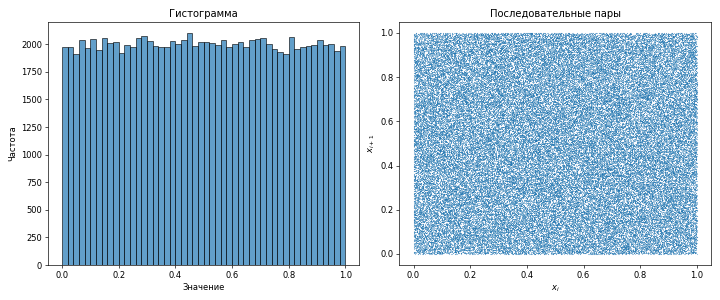

# Pseudorandom Number Generator

Генератор псевдослучайных чисел

## Реализованные алгоритмы генерации

### LCG

**Линейный конгруэнтный метод** — один из широко известных методов генерации псевдослучайных чисел. Применяется в простых случаях и не обладает криптографической стойкостью. Входит в стандартные библиотеки различных компиляторов. Преимуществом генераторов на основе этого метода является их быстрота за счет малого количества операций на бит.

Формула:

$X_{n+1} = (a \cdot X_n + c) \mod m$

Где $m$ - модуль, $a$ - множитель, $c$ - приращение, $X_0$ - начальное значение.

### Xorshift

**Xorshift** — открыты Джорджем Марсалья, генерация следующего числа в последовательности происходит путём многократного вычисления исключающее «ИЛИ» текущего числа и его битового сдвига, что делает xorshift чрезвычайно быстрыми на современных компьютерных архитектурах. Хотя «в сыром виде» они не проходят все статистические тесты случайности, этот недочёт хорошо известен и легко исправляется путём добавления в их структуру нелинейной функции, в результате чего получаются такие генераторы как xorshift+ или xorshift\*.

## Визуализация

Чтобы построить график, сгенерируйте большое количество вещественных чисел, и запустите python скрипт:

```sh
cargo run --bin=pseudorandom -- --count=100000 --float > random_numbers.txt
python3 pseudorandom/plot.py random_numbers.txt
```



## Список литературы

- [Разбор алгоритмов генерации псевдослучайных чисел](https://habr.com/ru/companies/vk/articles/574414/)
- [Линейный конгруэнтный метод](https://studfile.net/preview/4545007/page:2/)
- [Xorshift](https://ru.wikipedia.org/wiki/Xorshift)
