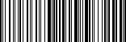

# Barcode and QR Code Generator

Программа для генерации штрих кодов Code 128 и QR кодов

## Barcode

Генератор штрих кодов Code 128:

- Кодирует символы ASCII (цифры, буквы, специальные символы).
- Три набора символов (A, B, C) с возможностью переключения между наборами:

  - Используйте `À`, `Ɓ` и `Ć` для переключения на постоянной основе.

### Структура Code 128

<br/>



<br/>

1. **Стартовый символ**:

   - Определяет набор, с которого начинается кодирование (START A, START B, START C)

2. **Данные**:

   - Последовательность символов, закодированных в соответствии с текущим набором.
   - Если используется Set C, числа группируются по 2 цифры.

3. **Контрольная сумма**:

   - Обеспечивает проверку целостности данных при сканировании

4. **Стоп-символ**:

   - Одинаков для всех наборов

## QR Code

Незаконченный генератор штрих кодов

### Процесс генерации QR кода

1. **Кодирование данных**

   Строка уже находится в UTF-8, поэтому используется побайтовый способ кодирования, когда последовательность байт конвертируется в последовательность бит.

2. **Добавление служебной информации и заполнения**

   1. К последовательности бит приписываются служебные поля: способ кодирования и длина последовательности
   2. Последовательность бит добивается нулями до кратности 8-ми и переводится в байты
   3. Далее последовательность байт добивается чередующимися 11101100 и 00010001 до нужного количества для подходящей версии.

3. **Разделение информации на блоки**

   В соответствии с версией и уровнем коррекции последовательность разбивается на определенное количество блоков.

4. **Создание байтов коррекции**

   Для каждого блока вычисляются байты коррекции алгоритмом Рида-Соломона.

5. **Объединение блоков**

   Блоки обратно объединяются в один поток байт

6. **Размещение информации на QR коде**

   1. На холст добавляются: поисковые узоры, выравнивающие узоры, полосы синхронизации, код версии, код маски и уровня коррекции.
   2. Заполнение хоста данными производится с правого нижнего угла, идёт в пределах столбика справа налево, снизу вверх, достигнув верха, продолжается cо столбика, который расположен левее, и идет сверху вниз.
   3. Подбирается маска, набравшая наименьшее количество штрафных очков, путем применения каждой по очереди.

<br/>


## Binary

```sh
cargo run --bin=generator -- barcode "Hello World" --path="code.png" --codeset=B
cargo run --bin=generator -- qr "Hello World" --path="code.png" --ecc=medium
```

## Список литературы

- [Code 128](https://en.wikipedia.org/wiki/Code_128)
- [Алгоритм генерации QR-кода](https://habr.com/ru/articles/172525/)
- [Пошагово создаём QR-код](https://habr.com/ru/companies/beeline_tech/articles/892884/)

---

> _This crate uses a [buntine/barcoders](https://github.com/buntine/barcoders) Code 128 encoding table and QR code tables from [kennytm/qrcode-rust](https://github.com/kennytm/qrcode-rust) licensed under MIT (see [LICENSE-THIRD-PARTY.md](./LICENSE-THIRD-PARTY.md))._
